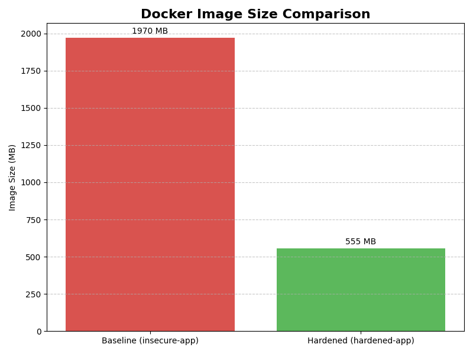
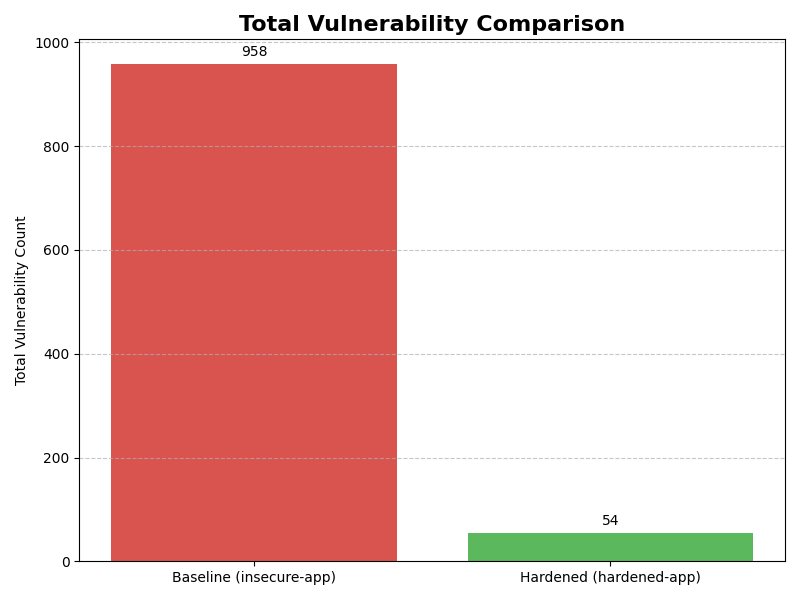

# 🛡️ Reducing Container Risk: A Multi-Dimensional Comparative Analysis of Docker Hardening Strategies

[](https://docs.docker.com/)
[](https://www.python.org/)
[](https://github.com/aquasecurity/trivy)
[](LICENSE)

> **"Default configurations are the silent killers of software security."**

## 📖 Project Overview

In modern DevSecOps, the choice of a container base image is often the single biggest determinant of an application's security posture. Developers frequently rely on default images like `python:latest` for convenience, unknowingly introducing massive attack surfaces.

This project is a **quantitative research experiment** conducted on **January 7, 2026**. It evaluates the efficacy of four distinct Docker hardening strategies by containerizing a fixed Python web application and analyzing the results across multiple dimensions: **Security (CVEs), Storage Efficiency, Supply Chain Complexity (SBOM), and Build Performance.**

### 🎯 The Objective
To scientifically identify the optimal hardening strategy that balances security, size, and operational efficiency.

---

## 🏗️ Methodologies Tested

We compared the "Insecure Baseline" against three industry-standard hardening strategies:

| Strategy | Base Image | Description |
| :--- | :--- | :--- |
| **1. Baseline (Control)** | `python:3.12` | The default, full Debian Bookworm OS. Contains compilers, manuals, and unused binaries. |
| **2. Debian Slim** | `python:3.12-slim` | A minimized version of Debian with documentation removed but standard glibc libraries retained. |
| **3. Alpine Linux** | `python:3.12-alpine` | A security-oriented, ultra-lightweight OS using the `musl` C-library instead of `glibc`. |
| **4. Distroless** | `gcr.io/distroless/python3` | A runtime-only image by Google that removes the command shell (`/bin/sh`) to prevent execution attacks. |

---

## 📊 Key Findings & Results

The experiment yielded striking data that challenges common assumptions about container security.

### 1. The Quantitative Comparison Matrix

| Metric | Baseline (Insecure) | Debian Slim | Distroless | **Alpine (Optimal)** |
| :--- | :---: | :---: | :---: | :---: |
| **Image Size** | 1.65 GB | 233 MB | 130 MB | **125 MB** |
| **Total Vulnerabilities** | 1,384 | 62 | 203 ⚠️ | **1** |
| **Critical/High CVEs** | 155 | 0 | 15 | **0** |
| **Software Components** | 503 | 114 | 51 | **57** |
| **Software Licenses** | 301 | 117 | 48 | **18** |
| **Build Time** | 8.1s | 8.3s | **7.4s** | 14.4s |

### 2. Visual Analysis

#### 📉 Attack Surface Reduction (Image Size)
The **Alpine** strategy achieved a **92.4% reduction** in storage footprint compared to the baseline.

*(Note: Ensure you upload your graph here)*

#### 🛡️ Vulnerability Mitigation
Hardening with Alpine eliminated **99.9%** of security risks.


### 3. The "Distroless Anomaly"
A critical discovery of this research was the performance of the **Distroless** image.
*   **Hypothesis:** Removing the shell (`/bin/sh`) makes the container secure.
*   **Reality:** Distroless retained **203 Vulnerabilities** (including 4 Critical).
*   **Root Cause:** Distroless is built on the Debian ecosystem (`glibc`). While it mitigates *dynamic* attacks (shell execution), it still inherits *static* vulnerabilities from the underlying libraries.
*   **Conclusion:** **Removing the shell $\neq$ Fixing the library bugs.**

---

## 🛠️ Tech Stack & Tools Used

The analysis relied on a suite of industry-standard DevOps tools:

*   **Docker:** Container runtime and build engine.
*   **Python (Flask):** The fixed application payload.
*   **Trivy & Grype:** Vulnerability scanners (CVE detection against NVD).
*   **Syft:** Software Bill of Materials (SBOM) generator.
*   **Dive:** Filesystem layer efficiency analyzer.
*   **Matplotlib/Pandas:** Python libraries for data visualization.

---

## 🚀 How to Reproduce This Experiment

Prerequisites: Docker Desktop and Python 3.10+.

**1. Clone the Repository**
```bash
git clone https://github.com/AMSONI777/docker-hardening-project.git
cd docker-hardening-project

2. Build the Images
code
Bash
# Build the Baseline
docker build -t insecure-app -f Dockerfile.insecure .

# Build the Hardened Variants
docker build -t hardened-app -f Dockerfile.secure .
docker build -t alpine-app -f Dockerfile.alpine .
docker build -t distroless-app -f Dockerfile.distroless .
3. Run the Analysis Scripts
We have automated the scanning and graphing process.
code
Bash
# Install requirements
pip install -r requirements.txt

# Run scans (Example with Trivy)
trivy image --format json --output trivy-results-alpine.json alpine-app

# Generate Graphs
python create_graphs.py
📄 Research Poster (Oklahoma Research Day 2026)
This project was presented at Oklahoma Research Day. The academic poster details the full narrative from problem identification to final architectural recommendations.


Click here to view the full PDF
🏆 Conclusion
This study confirms that Alpine Linux is the optimal hardening strategy for Python web applications.
Security: Reduced 1,384 CVEs to 1 (99.9% reduction).
Efficiency: Reduced 1.65 GB to 125 MB (92% reduction).
Compliance: Reduced 301 licenses to 18, simplifying legal review.
While Alpine requires a longer build time (14.4s vs 8.1s) due to source compilation, this trade-off is negligible compared to the massive gains in security and maintainability.
👤 Author
Amit Soni
Role: Researcher & DevOps Engineer
Institution: University of Central Oklahoma
GitHub: AMSONI777
Email: asoni2@uco.edu
This project is licensed under the MIT License - see the LICENSE file for details.
code
Code

