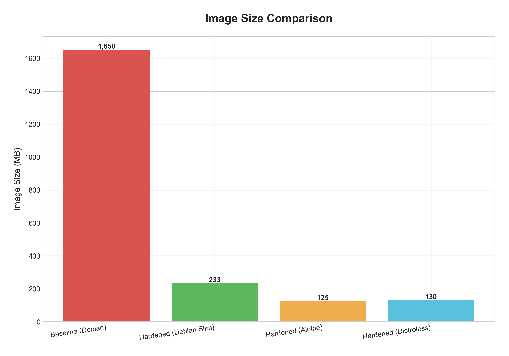
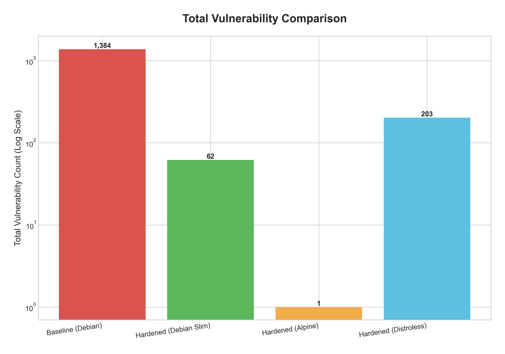

# 🛡️ Reducing Container Risk: A Multi-Dimensional Comparative Analysis of Docker Hardening Strategies

[](https://docs.docker.com/)
[](https://www.python.org/)
[](https://github.com/aquasecurity/trivy)

> *"Default configurations are the silent killers of software security."*

---

## 📖 Project Overview

In modern DevSecOps, the choice of a container base image is often the single most critical factor in determining an application's security posture. Developers frequently rely on default configurations (such as `python:latest`) for convenience, unknowingly introducing massive attack surfaces.

This project presents a **quantitative research experiment** conducted on **January 7, 2026**. It evaluates the efficacy of four distinct Docker hardening strategies by containerizing a fixed Python web application and analyzing the results across multiple dimensions: **Security (CVEs), Storage Footprint, Supply Chain Complexity (SBOM), and Build Performance.**

### 🎯 The Objective
To objectively identify the optimal hardening strategy that balances security, image size, compliance, and build speed.

---

## 🏗️ Methodologies Tested

We evaluated a standard "Baseline" configuration against three widely utilized hardening strategies:

| Strategy | Base Image | Description |
| :--- | :--- | :--- |
| **1. Baseline (Control)** | `python:3.12` | The default, unoptimized build utilizing a full Debian OS. Contains unnecessary system libraries, compilers, and utilities. |
| **2. Debian Slim** | `python:3.12-slim` | A minimized version of Debian with documentation and manual pages removed but standard `glibc` libraries retained. |
| **3. Alpine Linux** | `python:3.12-alpine` | A minimalist, security-oriented Operating System utilizing lightweight `musl-libc` instead of `glibc`. |
| **4. Distroless** | `gcr.io/distroless/python3` | A runtime-only environment by Google that completely removes the system shell (`/bin/sh`) to mitigate interactive execution attacks. |

---

## 📊 Key Findings & Results

The experiment yielded striking, data-driven insights that challenge common assumptions about container security.

### 1. The Quantitative Comparison Matrix

| Metric | Baseline (Control) | Debian Slim | Distroless | **Alpine (Optimal)** |
| :--- | :---: | :---: | :---: | :---: |
| **Image Size** | 1.65 GB | 233 MB | 130 MB | **125 MB** |
| **Total Vulnerabilities (CVEs)** | 1,384 | 62 | 203 ⚠️ | **1** |
| **Critical/High Severity CVEs** | 155 | 0 | 15 | **0** |
| **Software Components** | 503 | 114 | 51 | **57** |
| **Software Licenses** | 301 | 117 | 48 | **18** |
| **Build Time (Warm Cache)** | 8.1s | 8.3s | **7.4s** | 14.4s |

---

### 2. Visual Analysis

#### 📉 Attack Surface Reduction (Image Size)
The **Alpine** strategy achieved a **92.4% reduction** in storage footprint compared to the Baseline configuration.



#### 🛡️ Vulnerability Mitigation
Hardening with Alpine Linux eliminated **99.9%** of baseline security risks, leaving only a single low-severity vulnerability.



---

### 3. The "Distroless Anomaly"

> [!WARNING]
> **Key Finding:** While Distroless images are designed to increase security by removing the interactive command shell, static analysis showed that the image still harbored **203 vulnerabilities (including 4 Critical and 11 High severity)**.
> 
> * **The Root Cause:** Distroless is derived from the Debian ecosystem. While it successfully mitigates dynamic attacks by omitting `/bin/sh`, it still inherits static vulnerabilities from its underlying shared libraries (such as `glibc` and `openssl`).
> * **The Conclusion:** **Removing the command shell does not inherently resolve vulnerabilities present within underlying system files.**

---

## 🛠️ Tech Stack & Tools Used

The analysis relied on a suite of industry-standard security and DevOps tools:

*   **Docker:** Container runtime and multi-stage build engine.
*   **Python (Flask):** The fixed, standardized application payload.
*   **Trivy & Grype:** Vulnerability scanners used to map CVEs against the National Vulnerability Database (NVD).
*   **Syft:** Software Bill of Materials (SBOM) generator to catalog dependencies.
*   **Dive:** Image analyzer used to calculate filesystem layer storage efficiency.
*   **Matplotlib / Pandas:** Python data analysis stack used to generate comparisons.

---

## 🚀 How to Reproduce This Experiment

### Prerequisites
*   Docker Desktop installed and running
*   Python 3.10 or higher installed locally

### Step-by-Step Execution Guide

#### 1. Clone the Repository
```bash
git clone https://github.com/AMSONI777/docker-hardening-project.git
cd docker-hardening-project
```

#### 2. Build the Evaluated Images
```bash
# Build the Baseline (Control) Image
docker build -t insecure-app -f Dockerfile.insecure .

# Build the Hardened Variants
docker build -t hardened-app -f Dockerfile.secure .
docker build -t alpine-app -f Dockerfile.alpine .
docker build -t distroless-app -f Dockerfile.distroless .
```

#### 3. Run scans & Generate Data Visualizations
```bash
# Install Python dependencies locally
pip install -r requirements.txt

# Run security scans (Example using Trivy)
trivy image --format json --output trivy-results-alpine.json alpine-app

# Generate comparative charts
python create_graphs.py
```

---

## 📄 Research Presentation (Oklahoma Research Day 2026)

This project was presented as an academic poster at Oklahoma Research Day. The presentation details the full narrative, comparing operational trade-offs, OS architectures, and software licensing complexity.

_1.png)

---

## 🏆 Final Conclusion

The data confirms that for Python web applications, **Alpine Linux provides the optimal balance of secure deployment and storage efficiency**:

*   **Vulnerability Mitigation:** Achieved a **99.9% reduction** (1 CVE vs. 1,384 Baseline CVEs).
*   **Storage footprint:** Realized a **92.4% reduction** (125 MB vs. 1.65 GB Baseline).
*   **Compliance simplicity:** Reduced active software licenses from **301 to 18**, drastically lowering legal and compliance overhead.

While the Alpine build introduced a performance trade-off—taking **14.4 seconds** compared to **8.1 seconds** for the Baseline due to the necessity of compiling dependencies from source—the security and footprint advantages far outweigh this minimal time penalty.

---

## 👤 Authors

*   **Amit Soni**
    *   *Role:* Graduate Student Researcher
    *   *Institution:* University of Central Oklahoma
    *   *GitHub:* [@AMSONI777](https://github.com/AMSONI777)
    *   *Email:* asoni2@uco.edu

*   **Dr. Myungah (Grace) Park, Ph.D.**
    *   *Role:* Research Advisor
    *   *Institution:* University of Central Oklahoma
    *   *Email:* MPark5@uco.edu
